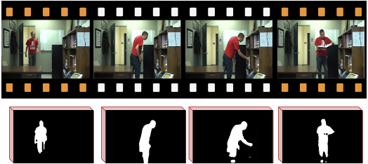

# ViBe - Pytorch

This repository contains a Pytorch implementation of the ViBe background subtraction algorithm with CPU and GPU support. 

<p align="center">
   &nbsp; &nbsp; &nbsp; &nbsp; &nbsp;
   &nbsp; &nbsp; &nbsp; &nbsp; &nbsp;
   &nbsp; &nbsp; &nbsp; &nbsp; &nbsp;
</p>

## Getting Started

The following instructions will help you install the required libraries and the dataset to run the code. The code runs in <code>python 3</code> and was tested on a laptop with a RTX2070Super GPU.

### Create environment

To create and setup the conda environment, simply follow these steps:

```bash
conda create -n vibe python=3.8
conda activate vibe
conda install pytorch=1.6 cudatoolkit=10.1 -c pytorch
pip install opencv-python
```

### Evaluation on CDNet 2014

First, you will need to download and extract the zip folder containing the CDNet 2014 dataset available on [changedetection.net](changedetection.net).

Then, to compute the mean F1 score on the dataset using GPU computations, simply run the following command line


```bash
python main.py --path path/to/CDNet2014/ --cdnet --device cuda
```

<p align="center">
  
</p>

### Computing the masks on any video

To compute motion detection masks on a single video using GPU computations, simply run the following command line:


```bash
python main.py --path path/to/video/ --save_path path/to/save/masks/ --device cuda
```

The masks are saved in the the path passed to the <code>--save_path</code> argument.


## Authors

See the [AUTHORS](AUTHORS) file for details.


## License

Custom non-permissive.
This work is protected by several patents.

See the [LICENSE](LICENSE) file for details.

The implementation of the median pooling layer is taken from [rwightman](https://gist.github.com/rwightman/f2d3849281624be7c0f11c85c87c1598). It is used only as post-processing of the masks produced by ViBe for evaluation on CDNet2014.

## Acknowledgments

* Anthony Cioppa is funded by the FRIA, Belgium and ARIAC/TRAIL.
