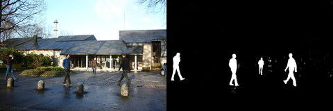

# ViBe: A universal background subtraction algorithm for video sequences

This repository contains several implementations of ViBe, a real-time algorithm for background subtraction.

Innovations: 
- Fastest algorithm for background subtraction based on samples.
- Operations limited to subtractions, comparisons and memory manipulation.
- Patented technology including the following novelties: a technique for model initialization, a random time sampling strategy, a spatial propagation strategy, the backwards analysis of images in a video stream.
- ViBe forms the basis of all the current unsupervised state-of-the-art algorithms for background subtraction.

<p align="center"></p>

## Implementations

Implementations in four programming languages are provided:

- [C](C): The fastest implementation of ViBe on CPU in the C language.
- [C++](C++): An upgrade in C++ of the C implementation.
- [Matlab](Matlab): a Matlab CPU implementation of ViBe.
- [Python](Python): a Pytorch implementation of ViBe with CPU and GPU support.

### Paper Abstract
This paper presents a technique for motion detection that incorporates several innovative mechanisms. For example, our proposed technique stores, for each pixel, a set of values taken in the past at the same location or in the neighborhood. It then compares this set to the current pixel value in order to determine whether that pixel belongs to the background, and adapts the model by choosing randomly which values to substitute from the background model. This approach differs from those based on the classical belief that the oldest values should be replaced first. Finally, when the pixel is found to be part of the background, its value is propagated into the background model of a neighboring pixel.
We describe our method in full details (including pseudocode and the parameter values used) and compare it to other background subtraction techniques. Efficiency figures show that our method outperforms recent and proven state-of-the-art methods in terms of both computation speed and detection rate. We also analyze the performance of a downscaled version of our algorithm to the absolute minimum of one comparison and one byte of memory per pixel. It appears that even such a simplified version of our algorithm performs better than mainstream techniques. 

How to cite this repository:

```bibtex
@article{Barnich2011ViBe,
	title = {{ViBe}: A universal background subtraction algorithm for video sequences},
	author = {O. Barnich and M. {Van Droogenbroeck}},
	journal = itip,
	year = {2011},
	volume = {20},
	number = {6},
	pages = {1709-1724},
	month = Jun,
	keywords = {ViBe, Background, Background subtraction, Segmentation, Motion, Motion detection},
	doi = {10.1109/TIP.2010.2101613},
	url = {http://doi.org/10.1109/TIP.2010.2101613},
	myurl = {http://hdl.handle.net/2268/81248}
}
```

## Patent

Before using ViBe, be aware that it is covered by several patents (patent track: WO2009007198 / Publication date: 2009-01-15; Priority number(s): EP20070112011 20070708) / Europe (granted): EP2015252 / US (granted): US 8009918 B2 (pdf) / Japan (granted): JP 2011 4699564 B2.

See the License files in each language for more details

## Author

See the Author files in each programming language folder for details.

## License

See the License files in each programming language folder for details.