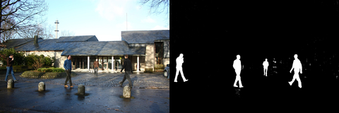

# ViBe: A universal background subtraction algorithm for video sequences

### NEWS: ViBe is now available for free even in commercial applications!


This repository contains several implementations of ViBe, a real-time algorithm for background subtraction.

Innovations: 
- Fastest algorithm for background subtraction based on samples.
- Operations limited to subtractions, comparisons and memory manipulation.
- ViBe is the perfect baseline for unsupervised background subtraction.

<p align="center"></p>

## Implementations

Implementations in four programming languages are provided:

- [C](C): an implementation of ViBe on CPU in the C language.
- [C++](C++): an alternative implementation in C++.
- [Matlab](Matlab): a Matlab CPU implementation of ViBe.
- [Python](Python): a Pytorch implementation of ViBe with CPU and GPU support.

Note that the parameters used in our implementation have changed. They are now: 
| Symbol | Name                                          | Original    |     New      | 
| :----: | --------------------------------------------- | :---------: | :----------: | 
| N      | `numberOfSamples` (samples per pixel model)   |      20     |      30      | 
| R      | `matchingThreshold`                           |      20     |      10      | 
| #min   | `matchingNumber`                              |       2     |       2      | 
| φ      | `updateFactor` (time-subsampling)             |      16     |       8      |

## Paper Abstract (adapted)
This paper presents ViBe, a background subtraction technique for motion detection. ViBe stores, for each pixel, a set of values taken in the past at the same location or in the neighborhood. It then compares this set to the current pixel value in order to determine whether that pixel belongs to the background, and adapts the model by choosing randomly which values to substitute from the background model. Finally, when the pixel is found to be part of the background, its value is propagated into the background model of a neighboring pixel.
We describe our method in full details (including pseudocode and the parameter values used). We also analyze the performance of a downscaled version of our algorithm to the absolute minimum of one comparison and one byte of memory per pixel. It appears that even such a simplified version of our algorithm performs better than mainstream techniques. 

Please cite our work if you use ViBe:

```bibtex
@article{Barnich2011ViBe,
	title = {{ViBe}: A universal background subtraction algorithm for video sequences},
	author = {Barnich, Olivier and {Van Droogenbroeck}, Marc},
	journal = {IEEE Transactions on Image Processing},
	year = {2011},
	volume = {20},
	number = {6},
	pages = {1709-1724},
	month = {June},
	keywords = {ViBe, Background, Background subtraction, Segmentation, Motion, Motion detection},
	doi = {10.1109/TIP.2010.2101613},
	url = {http://doi.org/10.1109/TIP.2010.2101613},
	myurl = {http://hdl.handle.net/2268/81248}
}
```

## Patent

** [NEW FROM 01/2026] ViBe is now totally free, even for commercial uses!**. 
Initially ViBe was covered by several patents (patent track: WO2009007198 / Publication date: 2009-01-15; Priority number(s): EP20070112011 20070708) / Europe (granted): EP2015252 / US (granted): US 8009918 B2 / Japan (granted): JP 2011 4699564 B2.

See the License files in each programming language for more details

## Author

See the Author files in each programming language folder for details.

## License

See the License files in each programming language folder for details.
